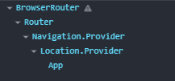

# 감정일기장 프로젝트

## 목표

- 이미지 사용법 : 최적화
- 다양한 페이지 제공하는 방법: 라우팅
- 외부 폰트 사용법 : CDN
- 공통 컴포넌트 : UI컴포넌트
- 클라우드 서비스 : cloud

### 페이지 라우팅(Page Routing)

- index, new, diary 페이지 존재
- 어떤 원리로 이뤄질까?

html파일 다 가지고 있어서 /url 주소 요청하면 해당 페이지 반환
브라우저는 해당 페이지 html을 렌더링

### Multi Page Application(MPA)

- 전통적이고 일반적인 방식
- html을 가지고 있는 것

### 서버 사이드 렌더링(Server Side Rendering)

- 미리 완성된 페이지를 응답하는걸 서버 사이드 렌더링 방식

## React.js는 MPA 방식을 따르지 않는다. / MPA의 단점

- 이게 시간이 걸리기 때문에 페이지 이동이 쾌적하지 못해서 선택을 안함
- 원래 있던 페이지를 제거하고 다시 렌더링 하는 MPA가 느리다.(비효율적)
- 새로고침도 된다.
- 사용자가 다수일때도 다 하나하나 처리해야 되서 서버의 부하가 심해진다.

### Single Page Application(SPA)방식

- 페이지 이동이 매끄럽고 효율적
- 다수의 사용자가 사용해도 효율적
- 페이지를 한개만 가지고 있음

- 빈 껍데기인 index.html을 반환

```js
<!doctype html>
<html lang="en">
  <head>
    <meta charset="UTF-8" />
    <link rel="icon" type="image/svg+xml" href="/vite.svg" />
    <meta name="viewport" content="width=device-width, initial-scale=1.0" />
    <title>Vite + React</title>
  </head>
  <body>
    <div id="root"></div>
    <script type="module" src="/src/main.jsx"></script>
  </body>
</html>

```

- 합쳐진 JS 파일(Bunding) Budle JS File : Vite가 작동
- 합쳐진 JS 파일이 브라우저에 전달해서 번들 파일을 직접 실행한다.

```js
import { createRoot } from "react-dom/client";
import "./index.css";
import App from "./App.jsx";

createRoot(document.getElementById("root")).render(<App />);
```

- Client Side Rendering

  - Bundle File 로 실행해서 컴포넌트 렌더링 하는 것을 브라우저가 렌더링 한다 해서 client side rendering이다.

- Bundle JS Files에 React의 모든 것이 담겨서 React APP이라 부른다.

## 개발 세팅

1. vite로 설치

```bash
 npm create vite@latest
```

> project name, React, JavaScript 선택

2. npm 설치

```bash
npm i or install
```

3. eslint.config.js 셋팅

```js
rules: {
  'no-unused-vars' : 'off',
  'react/prop-types' : 'off'
}

```

4. main.jsx - StrictMode 지우기

5. 필요없는 파일들 삭제
   - public/.svg 삭제
   - src/assets/.svg 삭제
   - src/index.css 내용 삭제
   - src/App.css 내용 삭제
   - src/main.jsx StrictMode 삭제
   - src/App.jsx useState 삭제

## React Router

- npmjs.com 에 공식 등록되어 있는 라이브러리
- Cilent Side Routing
- Nested Routing

```bash
npm i react-router-dom
```

버전 v6.0대 이상
package.json

```json
{
  "dependencies": {
    "react-router-dom": "^7.6.3"
  }
}
```

main.jsx 파일에 BrowserRouter

```jsx
import { createRoot } from "react-dom/client";
import "./index.css";
import App from "./App.jsx";
import { BrowserRouter } from "react-router-dom";

createRoot(document.getElementById("root")).render(
  <BrowserRouter>
    <App />
  </BrowserRouter>
);
```



root compoenet - BrowserRouter
