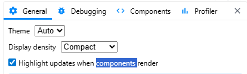
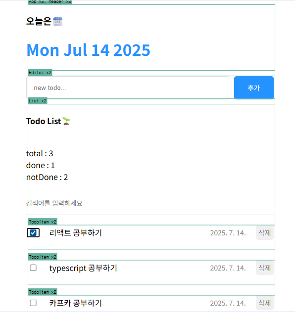

# 최적화

- F12 > Components > Setting > Highlight 체크
  

- 리렌더링 되는 것들 보기
  
  - Header 컴포넌트가 불필요하게 리렌더링 되는 모습을 볼 수 있다.

```jsx
import { memo } from "react";
const Header = () => {};
const memoizedHeader = memo(Header); // Props가 되지 않으면 리렌터링 되지 않음
export default memoizedHeader;
```

- Fast refresh only works when a file only exports components. Move your component(s) to a separate file.eslint(react-refresh/only-export-components)
- eslint 옵션을 끄면 된다.
  `eslint.config.js`

```js
rules : {
    "react-refresh/only-export-components": "off"
}
```

TodoList >>> onCreate, onDelete, onUpdate 함수가 다 리렌딩,
함수는 객체타입: 주소값으로 저장이 된다 , 새롭게 생길때마다 다른 값으로 인식

```js
const a = { a: 1 };
const b = { a: 1 };
consoleo.log(a === b); //false
```

> 기본적으로 memo는 얇은 비교(===)를 하기 때문에 객체값은 다른것이라 판단하게 된다.
> 다른 주소값이기 때문에 다른 것이라 판단되는 것이다.

방법 1, 2가 있는데
2로 이번에 해본다.
memo 함수의 2번째 인자에 콜백함수를 전달해서 최적화 기능을 커스터마이징 한다.

### 형식

```jsx
export default memo(TodoItem, () => {});
```

예시:

## 고차 컴포넌트(HOC Pattern)

- 다른 컴포넌트를 받는 컴포넌트라는 뜻
- 인자로 넘긴 컴포넌트에게 추가되길 원하는 로직을 가지고 있다.
- HOC는 로직이 적용된 엘리먼트를 반환하게 된다.

```jsx
export default memo(TodoItem, (prevProps, nextProps) => {
  // 반환값에 따라 Pros가 바뀌었는지 안바뀌었는지 판단
  // T > Props가 바뀌지 않음 : 리렌더링 x
  // F > Props 바뀜 : 리렌더링 O
  if (prevProps.id !== nextProps.id) return false;
  if (prevProps.isDone !== nextProps.isDone) return false;
  if (prevProps.content !== nextProps.content) return false;
  if (prevProps.date !== nextProps.date) return false;
  return true;
});
```

## Reference

- [HOC](https://patterns-dev-kr.github.io/design-patterns/hoc-pattern/)

# useCallback

```jsx
useCallback(() => {}, []);
``;
```
