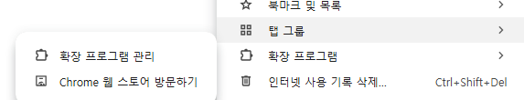
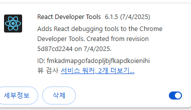
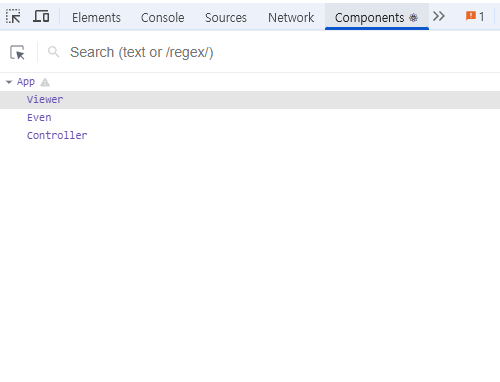

# [react-developer-tools](https://chromewebstore.google.com/detail/react-developer-tools/fmkadmapgofadopljbjfkapdkoienihi?hl=ko)

1. 설치
2. 확장 프로그램 관리

   

3. 세부 정보
   토글 ON

   

4. 토글 ON : 사용, 툴바에 고정, 시크릿모드에서 허용, 파일 URL에 대한 엑세스 허용

5. 앱으로 돌아가서 툴바에서 react 빨간불 들어오면 F12>Components 로 확인가능
   
