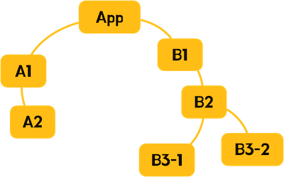
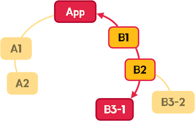
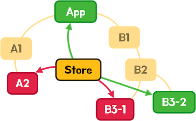

# Zustand 5.0.5

- 작고 빠르며 확장 가능한 React 프로젝트에서 사용하는 상태 관리(Store) 라이브러리이다.

## v5

- React v18 이상 필요
- TypeScript v4.5 이상 필요
- UMD/SystemJS 지원 중단
- ES5 지원 중단
- 기본 내보내기(Default Export) 삭제
- Persist 미들웨어가 초기 상태를 바로 스토리지에 저장하지 않음
- use-sync-external-store 패키지가 피어 종속성으로 변경, 필요한 경우 직접 설치
- setState의 상태 대체(replace)가 더욱 엄격하게 동작

## Store

- 애플리케이션의 여러 상태(State, 관리하는 데이터)를 중앙에서 관리하는 패턴
  이를 통해 컴포넌트 간 데이터를 쉽게 공유하고 데이터 변경을 감지해 자동으로 렌더링(반응성) 할 수도 있다.



- 만약 컴포넌트 간에 공유해야 하는 데이터가 있다면 기본적으로 부모와 자식 컴포넌트 간 데이터 전달이 가능하다.
- Props 방식
- 중첩된 컴포넌트 구조에서 불필요하게 데이터를 취급하는 중간 단계의 컴포넌트가 생기고 결합도가 높아지며 유지 보수가 어려워진다.
  

## Props Drilling

- 이를 피하기 위해 Store 를 사용해서 컴포넌트 간 공유할 데이터를 중앙에서 관리하는데
  중간 단계 컴포넌트가 필요치 않으므로 컴포넌트 간 결합도를 낮추고 유지/보수를 쉽게 만든다.



```bash
npm i zustand
```

```tsx

import { create } from 'zustand';
{/*store 생성
콜백은 set, get 매개변수를 가지고 이를 통해 상태 변경 및 조회가 가능하다.
create 함수의 콜백이 반환하는 객체에서의 속성은 state 이고 메소드는 action이다.
create 함수 호출에서 반환하는 스토어 훅(Hook)은 useCountStore와 같이 use접미사, Store 접미사로 명명해서 각 컴포넌트에서 사용 가능하다.
*/}
export const use__Store = create((set, get) => {
    return {
        상태: initValue,
        action: function () => {
            const state  = get()
            const {상태} = state
            set({
                상태 : 상태 + 1
            })
        }
    }
})
```

```tsx
import { create } from "zustand";

export const use이름Store = create((set) => {
  return {
    상태: initValue,
    action: () => {
      set((state) => ({
        상태: state.상태 + 1,
      }));
    },
  };
});
```

- get함수를 호출하면 상태와 액션을 가진 store 객체(state)를 얻을 수 있다.
- set함수를 호출(변경할 상태를 속성으로 포함한 객체를 전달)하면 상태를 변경할 수 있다.
- set함수를 호출할 때 콜백을 사용하면 get함수를 사용하지 않아도 바로 store 객체 얻을 수 있다.
- 변경할 상태를 속성으로 포함한 객체를 콜백에서 반환해야 한다.

```tsx
import { create } from "zustand";

export const useCountStore = create<{
  count: number;
  increase: () => void;
  decrease: () => void;
}>((set) => ({
  count: 1,
  increase: () => set((state) => ({ count: state.count + 1 })),
  decrease: () => set((state) => ({ count: state.count - 1 })),
}));
```

생성한 스토어를 다음과 같이 컴포넌트에서 사용할 수 있다.

```tsx
import { useCountStore } from "./store/count";

export default function App() {
  const count = useCountStore((state) => state.count);
  const increase = useCountStore((state) => state.increase);
  const decrease = useCountStore((state) => state.decrease);
  return (
    <>
      <h2>{count}</h2>
      <button onClick={increase}>+1</button>
      <button onClick={decrease}>-1</button>
    </>
  );
}
```

## 다중 상태 선택 (useShallow)

- useShallow 훅을 사용하면 여러 상태(액션)을 한번에 객체나 배열로 가져올 수 있다.
- store hook에서 Zustand의 useShallow 훅 중첩 호출해 선택자 함수를 전달한다.
- 이때 선택자 함수는 사용하고자 하는 상태(액션)을 포함하는 객체나 배열을 반환해야 한다.

```ts
import { useShallow } from "zustand/shallow";

const { 상태, 액션 } = use이름Store(
  useShallow((state) => ({
    상태: state.상태,
    액션: state.액션,
  }))
  // 또는 배열로 한꺼번에 가져온다.
  // useShallow(state => [state.상태, state.액션])
);
```

- `count`, `increase`, `decrease` 상태(액션)을 하나씩 가져오지 않고 한꺼번에 가져온다.
- 객체 구조 분해 할당으로 사용할 상태만 가져올 수도 있고 한번에 객체로 모아 처리하는 경우도 있다.

```tsx
import { useShallow } from "zustand/shallow";
import { useCountStore } from "./store/count";

export default function App() {
  // const count = useCountStore(state => state.count)
  // const increase = useCountStore(state => state.increase)
  // const decrease = useCountStore(state => state.decrease)

  // const { count, increase, decrease } = useCountStore(state => ({
  const countState = useCountStore(
    useShallow((state) => ({
      count: state.count,
      increase: state.increase,
      decrease: state.decrease,
    }))
    // 또는 한번에 배열로 가져온다.
    // const countState = useCountStore(
    //useShallow(state => [state.count, state.increase, state.decrease]))
  );
  return (
    <>
      <h2>{countState.count}</h2>
      <button onClick={countState.increase}>+1</button>
      <button onClick={countState.decrease}>-1</button>
    </>
  );
}
```

## 액션 분리

- 여러 컴포넌트에서 단일 스토어의 액션을 많이 사용한다면 액션을 분리해 관리하는 패턴을 활용한다.
- actions 객체 안에서 모든 액션을 관리하면 각 컴포넌트에서 필요한 액션만 가져오기 쉽다.

```ts
import { create } from "zustand";

export const useCountStore = create<{
  count: number;
  actions: {
    increase: () => void;
    decrease: () => void;
  };
}>((set) => ({
  count: 1,
  actions: {
    increase: () => set((state) => ({ count: state.count + 1 })),
    decrease: () => set((state) => ({ count: state.count - 1 })),
  },
}));
```

```tsx
import { useCountStore } from "./store/count";

export default function App() {
  const count = useCountStore((state) => state.count);
  const { increase, decrease } = useCountStore((state) => state.actions);
  return (
    <>
      <h2>{count}</h2>
      <button onClick={increase}>+1</button>
      <button onClick={decrease}>-1</button>
    </>
  );
}
```

[도움](https://www.heropy.dev/p/n74Tgc)
